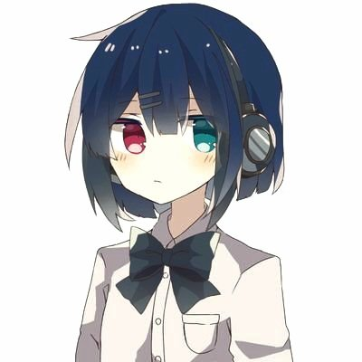

# イントロダクション
この文書、**The Book of げんおり！** は、高校 2 年生[^1]の spa が、

- 自分の言オリのための知識の整理
- mdBook+GitHub Pages による Web サイトのホスティング
- あわよくば、言語学オリンピックの布教

のために試みている、言語学オリンピック対策本となることを目標とした†史上初めて†の執筆プロジェクトです！ よろしくお願いします。

## 言語学オリンピックの紹介！
**言語学オリンピック**（言オリ、国際大会は The International Linguistics Olympiad (IOL)）は、言語を題材にした<kenten>パズル</kenten>です。具体的には、

<center>初見の言語のデータから帰納的推論でもってその言語を記述し、各問題に答える</u></center>

ことが求められます。語学の諸大会とちがって、暗記力や個別言語の能力は問われません（自己完結性）。

言語の分析は非常に楽しい作業です。言オリの問題を解くことで言語の多様性、そしてこれから導かれる広い世界を体感できます。あなたも言オリを始めましょう！[^2] 言語学オリンピックの JOL 委員会による説明は[ここ](https://iolingjapan.org/information/)で読めます。こんな駄文ではなくこちらを読みましょう。

## 執筆方針
通じる人は数人かと思いますが、これは以前はてなブログにて公開していた「解説をすらすら読めるようになる」という目標を引き継いでもいます。つまり、言語学オリンピックでの実用を念頭に置いた方針でもって執筆したいと考えています。

これは特に術語の表記に強くあらわれます。日本言語学オリンピック（JOL、以下国内予選などと表記）の過去問は数が限られているため、多くの熱心な参加者は英国言語学オリンピック（UKLO）の問題に加えて取り組みます。UKLO の解説を不自由なく読める、必要十分な程度で英語の術語を掲載します。

## 著者自己紹介


**spa** (spalits00)  
高校 2 年です。せっかく作った雰囲気をここで壊しますが、言オリでは```APLO’22 国内54位 / 67名中```と惨敗しています。よろろすお願いするます❗ Twitter は[```@spalits00```](https://twitter.com/spalits00)でやっています。

## mdBook 製ドキュメントの使いかた
- 本文左上に表示されている絵筆のアイコンでカラースキーム（配色テーマ）の変更
- 章・節見出しをクリックしてアンカー付き URL に変化

## 脚注
[^1]2022 年 11 月現在。  
[^2]このサイトで言オリを初めて知ったという人はまずいないと思いますが、万が一そういう場合には是非公式の[「お試し問題」](https://iolingjapan.org/sample-problems/)にチャレンジしてみてください！
<hr>
2022.11.27 作成／2022.11.27 更新